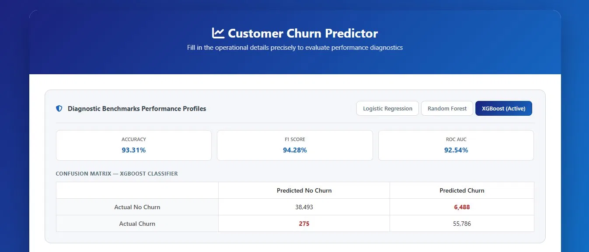
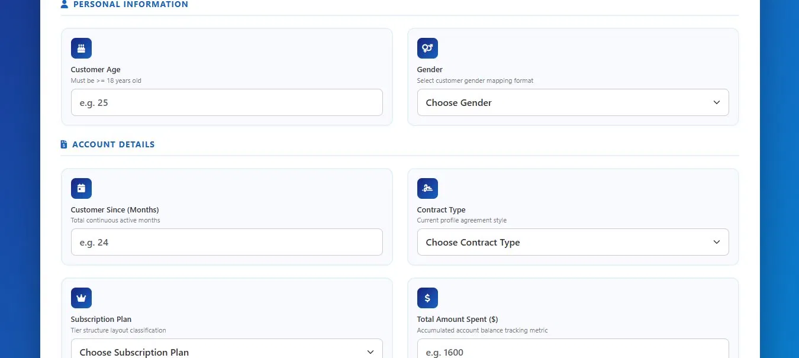
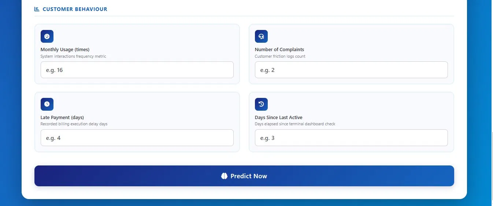
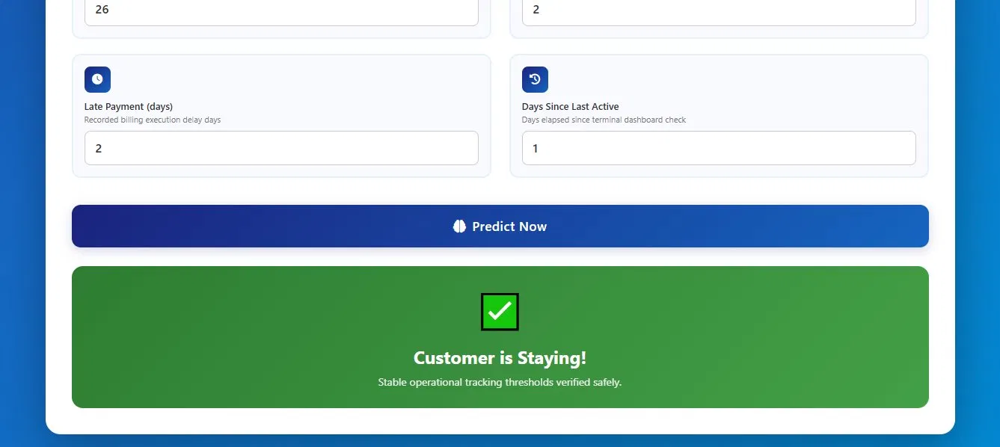
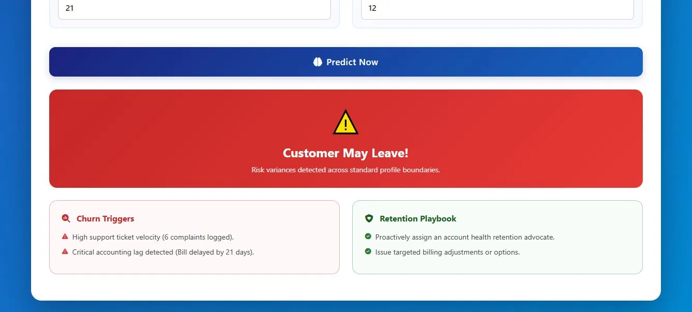

# 📉 ChurnGuard — Customer Churn Predictor

A **machine learning web application** that predicts whether a customer is likely to churn using three powerful ML models — Logistic Regression, Random Forest, and XGBoost — built with Python and Flask, no external API required.

---

## 🚀 Live Demo

> 🌐 [Live Demo](https://customer-churn-prediction-r8o2.onrender.com)

---

## 📌 Project Overview

This project classifies customers as **Churn** or **No Churn** using a large real-world dataset of 505,207 customer records, comparing the performance of three machine learning models.

| Component      | Details                                              |
| -------------- | ---------------------------------------------------- |
| **Models**     | Logistic Regression, Random Forest, XGBoost          |
| **Best Model** | XGBoost — saved as active production model           |
| **Dataset**    | 505,207 customer records (train + test merged)       |
| **Deployment** | Flask + Render                                       |

---

## 🖼️ App Preview

### 📊 Model Benchmarks Panel
> Tabbed view showing Accuracy, F1 Score, ROC AUC and full Confusion Matrix for all 3 models



---

### 📋 Prediction Form — Personal Info & Account Details
> Fill in customer profile across three sections with clean input cards



---

### 📋 Prediction Form — Customer Behaviour & Predict Button
> Behaviour metrics section and the Predict Now trigger button



---

### ✅ Result — Customer is Staying
> Green result banner when the model predicts no churn risk



---

### ⚠️ Result — Customer May Leave
> Red churn alert with Churn Triggers and Retention Playbook cards



---

## 📊 Model Performance

### Logistic Regression

| Metric   | Score  |
| -------- | ------ |
| Accuracy | 84.55% |
| F1 Score | 85.82% |
| ROC AUC  | 84.59% |

```
Confusion Matrix:
[[38214  6767]
 [ 8841 47220]]
```

---

### Random Forest

| Metric   | Score  |
| -------- | ------ |
| Accuracy | 92.46% |
| F1 Score | 93.51% |
| ROC AUC  | 91.80% |

```
Confusion Matrix:
[[38558  6423]
 [ 1193 54868]]
```

---

### XGBoost ⭐ Best Model (Active)

| Metric   | Score  |
| -------- | ------ |
| Accuracy | 93.31% |
| F1 Score | 94.28% |
| ROC AUC  | 92.54% |

```
Confusion Matrix:
[[38493  6488]
 [  275 55786]]
```

---

## 🧠 What I Built

| Component         | Details                                                                              |
| ----------------- | ------------------------------------------------------------------------------------ |
| **Dataset**       | 505,207 records from train + test CSVs merged                                        |
| **Cleaning**      | Dropped CustomerID, null removal, Gender label encoding, one-hot encoding for Subscription Type & Contract Length |
| **Balancing**     | SMOTE applied to training set — balanced to 224,431 samples per class                |
| **Scaling**       | StandardScaler on all numeric features                                               |
| **Models**        | LR (`max_iter=1000`), RF (`n_estimators=300, max_depth=10`), XGB (`n_estimators=300, learning_rate=0.1, max_depth=7`) |
| **Persistence**   | XGBoost + scaler saved as `.pkl` — no retraining on every restart                   |
| **App**           | Flask + Bootstrap 5 — blue/white theme, single-page form with tabbed metrics panel  |

---

## 🔍 Features Used

| Feature            | Type        | Description                          |
| ------------------ | ----------- | ------------------------------------ |
| Age                | Numeric     | Customer age (≥ 18)                  |
| Gender             | Encoded     | Male = 1, Female = 0                 |
| Tenure             | Numeric     | Months as active customer            |
| Usage Frequency    | Numeric     | Monthly platform interactions        |
| Support Calls      | Numeric     | Number of complaints raised          |
| Payment Delay      | Numeric     | Days late on billing                 |
| Total Spend        | Numeric     | Cumulative amount spent ($)          |
| Last Interaction   | Numeric     | Days since last active session       |
| Subscription Type  | One-Hot     | Basic / Standard / Premium           |
| Contract Length    | One-Hot     | Annual / Monthly / Quarterly         |

---

## 🔮 Why XGBoost?

XGBoost was chosen as the production model because:

- **Lowest false negatives** — only 275 missed churners vs 8,841 for Logistic Regression. In business, missing a churner is far costlier than a false alarm.
- **Best F1 Score (94.28%)** — handles class imbalance well even after SMOTE
- **Gradient boosting** captures complex non-linear patterns like monthly contract + low usage combinations
- Lightweight enough to run on Render's free tier without GPU

---

## ✨ App Features

**Prediction Form** — fill in 10 customer fields across three sections (Personal Info, Account Details, Customer Behaviour) and get an instant Churn / No Churn result.

**Churn Triggers** — when churn is predicted, the app explains why (high support calls, payment delays, monthly contract with low usage).

**Retention Playbook** — actionable strategies shown alongside each churn trigger.

**Model Benchmarks Panel** — tabbed view showing Accuracy, F1, ROC AUC, and Confusion Matrix for all three models side-by-side.

---

## 🔮 Future Roadmap

- [ ] SHAP values to highlight which features drove each individual prediction
- [ ] Confidence score / probability bar shown on result
- [ ] Threshold tuning — allow adjusting the classification cutoff
- [ ] Bulk CSV upload for batch churn predictions
- [ ] User feedback loop to retrain model over time
- [ ] REST API endpoint for CRM integration

---

## ⚙️ How to Run Locally

**1. Clone the repo**
```bash
git clone https://github.com/yourusername/churnguard.git
cd churnguard
```

**2. Install dependencies**
```bash
pip install -r requirements.txt
```

**3. Train the models** *(only once — saves churn_model.pkl and scaler.pkl)*

Open `main.ipynb` in VS Code / Jupyter and run all cells.

**4. Launch the app**
```bash
python app.py
```
Then open `http://localhost:5000` in your browser.

> Make sure `churn_model.pkl` and `scaler.pkl` are in the root folder before running.

---

## 📁 Project Structure

```
churnguard/
│
├── app.py                                        # Flask web application
├── main.ipynb                                    # ML pipeline — EDA, training, evaluation
├── customer_churn_dataset-training-master.csv
├── customer_churn_dataset-testing-master.csv
├── churn_model.pkl                               # Saved XGBoost model (auto-generated)
├── scaler.pkl                                    # Saved StandardScaler (auto-generated)
├── templates/
│   └── index.html                                # Frontend — Bootstrap 5 single-page UI
├── screenshots/                                  # App preview images for README
│   ├── metrics_panel.png
│   ├── form_top.png
│   ├── form_bottom.png
│   ├── result_staying.png
│   └── result_churn.png
├── requirements.txt                              # Python dependencies
└── README.md                                     # Project documentation
```

---

## 📦 Requirements

```
flask
pandas
numpy
scikit-learn
xgboost
imbalanced-learn
matplotlib
seaborn
```

---

## 🌐 Deploy on Render

1. Push all files including `.pkl` files to GitHub
2. Go to [render.com](https://render.com) → **New → Web Service**
3. Connect your repo
4. Set start command:
```bash
python app.py
```
5. Add environment variable: `PORT=5000`
6. Click **Deploy**

> Commit `churn_model.pkl` and `scaler.pkl` to GitHub to avoid retraining on every deploy.

---

## 🔑 Key Learnings

- **SMOTE before scaling** — SMOTE must be applied on unscaled training data to avoid data leakage; scaler is fit after resampling
- **False negatives matter more than accuracy** — XGBoost's 275 false negatives vs Logistic Regression's 8,841 is the real business differentiator
- **One-hot encoding at inference time** — the app manually reconstructs the exact 14-column feature matrix matching training layout
- **PRG pattern in Flask** — Post-Redirect-Get via `session` prevents duplicate form submissions on browser refresh
- **SMOTE balancing** — merged dataset had class imbalance; SMOTE brought training to perfectly balanced 224,431 samples per class

---

## 👨‍💻 Author

**Rami Rahil Rohitbhai**
JG University
[LinkedIn](https://www.linkedin.com/in/rami-rahil-2a7538348) · [GitHub](https://github.com/Rahil567)

---

*Built with ❤️ using Python · Pandas · scikit-learn · XGBoost · imbalanced-learn · Flask · Bootstrap 5*
*B.Tech AI & Data Science — Project*
